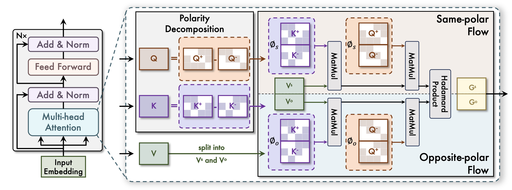
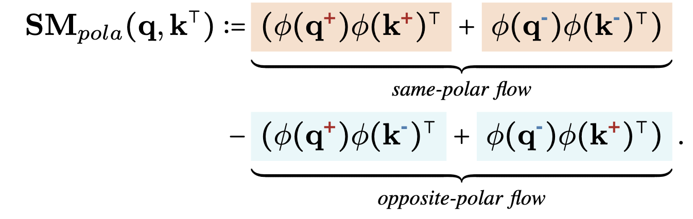
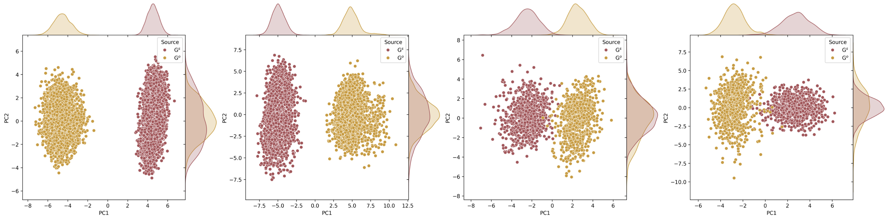
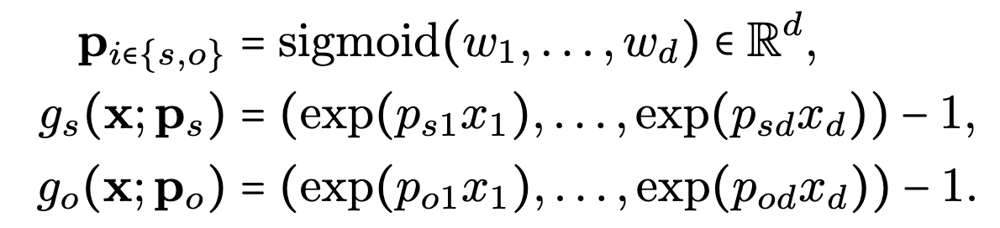
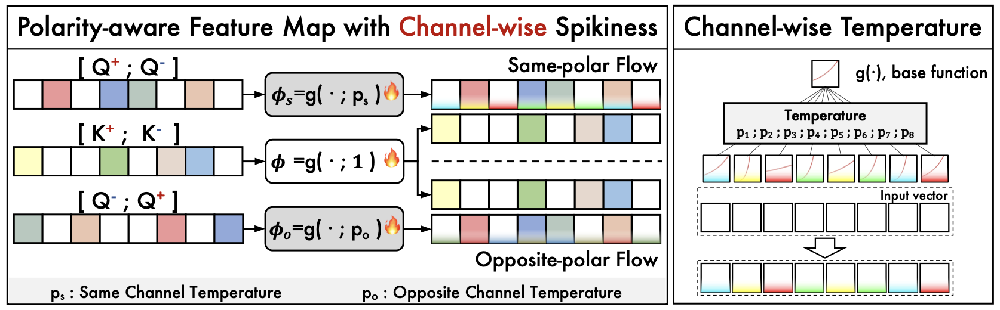
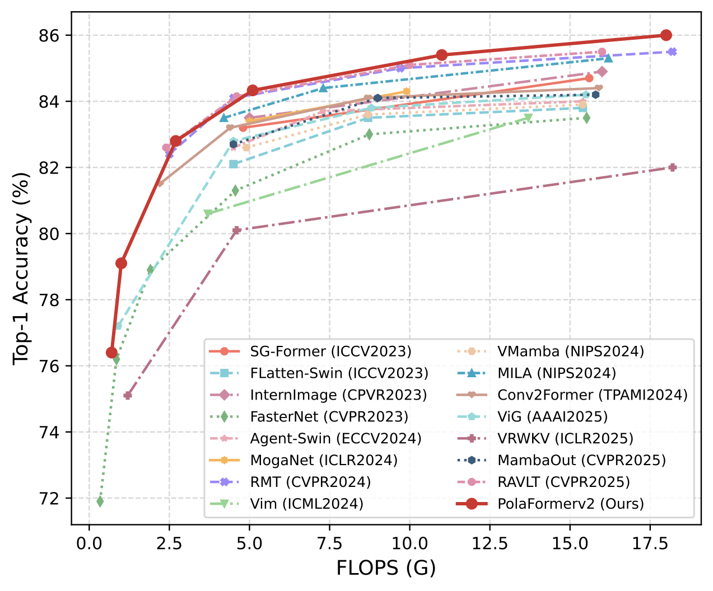

# PolaFormer++: Polarity-aware Linear Attention with Channel-wise Spikiness
Official code of PolaFormer++, an extension of the ICLR 2025 conference paper, **PolaFormer: Polarity-aware Linear Attention for Vision Transformers**.

## Introduction

### **Motivation**

Although Transformers have achieved remarkable success in vision tasks, the quadratic complexity of their self-attention mechanism limits scalability, motivating the development of linear attention approaches that reformulate attention computation through kernel-based feature mappings with linear complexity. However, existing linear attention models often suffer from significant performance degradation due to overly simplistic feature maps, which restrict their practical applicability. In particular, current feature map designs face two fundamental limitations: the non-negativity constraint that discards negative correlations, and the use of overly smooth kernels that increase the entropy of attention weights, thereby weakening discriminability. To address these challenges, we propose **Polarity-Aware Linear Attention with Channel-wise Spikiness (PolaFormer++)**, which is a unified framework that captures complete query–key interactions while preserving the spiky property as in Softmax attention with a flexible channel-wise feature map.

### **Method**

In this paper, we present a novel polarity-aware linear attention mechanism, which accurately captures all query-key interactions in inner-product. Our method incorporates a dual learnable spiky function, that dynamically rescales the magnitudes of same and opposite-signed components, effectively reducing entropy of the attention weight in linear attention.we propose the polarity-aware linear attention mechanism that explicitly models both same-signed and opposite-signed query-key interactions, ensuring comprehensive coverage of relational information. Furthermore, to restore the spiky properties of attention maps, we prove that the existence of a class of element-wise functions (with positive first and second derivatives) can reduce entropy in the attention distribution. Finally, we employ a learnable power function for rescaling, allowing strong and weak attention signals to be effectively separated.

<p align="center">
    
</p>

**PolaFormer: Polarity-aware Linear Attention**

Polarity-aware attention mechanism separates query-key pairs based on their polarity, computing their interactions independently. The attention weights are calculated as follows: To address this information loss, our polarity-aware attention mechanism separates query-key pairs based on their polarity, computing their interactions independently. The attention weights are calculated as follows:

<p align="center">
    
</p>

To avoid the pitfalls of subtractive operations, we instead introduce a Polarity Gating Matrix $\mathbf{G}$, a learnable polarity-aware gating matrix to weight the contributions of same-signed and opposite-signed query-key similarities and approximate the subtractive operation in Equation. As shown in Figure, there is a clear negative correlation and value discrepancy between the weights learned in $\mathbf{G}^{s}$ and $\mathbf{G}^{o}$

<p align="center">
    
</p>

**Polarity-aware Feature Map with Channel-wise Spikiness**

Considering that different channels contribute unequally to feature representation, we introduce a channel-wise temperature vector $\mathbf{p} \in \mathbb{R}^d$ into the exponential mapping function. This enables each channel to adjust its own degree of sharpness, transforming the uniform mapping across channels into adaptive, channel-dependent mappings. Furthermore, the contribution of each channel varies not only within a single polarity flow but also between the same-polar and opposite-polar flows. To capture this difference, we assign a dedicated temperature vector to each flow, resulting in the final polarity-aware feature map with channel-wise spikiness (PaCS).

<p align="center">
    
</p>

<p align="center">
    
</p>

## Dependencies

- Python 3.9
- PyTorch == 1.11.0
- torchvision == 0.12.0
- numpy
- timm == 0.4.12
- einops
- yacs

## Data preparation

The ImageNet dataset should be prepared as follows:

```
$ tree data
imagenet
├── train
│   ├── class1
│   │   ├── img1.jpeg
│   │   ├── img2.jpeg
│   │   └── ...
│   ├── class2
│   │   ├── img3.jpeg
│   │   └── ...
│   └── ...
└── val
    ├── class1
    │   ├── img4.jpeg
    │   ├── img5.jpeg
    │   └── ...
    ├── class2
    │   ├── img6.jpeg
    │   └── ...
    └── ...
```

## Train Models from Scratch

To train our model on ImageNet from scratch, see pretrain.sh and run:

```
bash pretrain.sh
```

## Results

<p align="center">
    
</p>

| Model | Params | Flops | Acc |
| --- | --- | --- | --- |
| b0 | 7M | 0.7G | 76.9% |
| b1 | 9M | 1.0G | 79.1% |
| b2 | 16M | 2.7G | 82.8% |
| b3 | 27M | 5.1G | 84.3% |
| b4 | 50M | 11G | 85.4% |
| b5 | 97M | 18G | 85.6% |

## Acknowledgements

This code is developed on the top of [PolaFormer](https://github.com/ZacharyMeng/PolaFormer).
